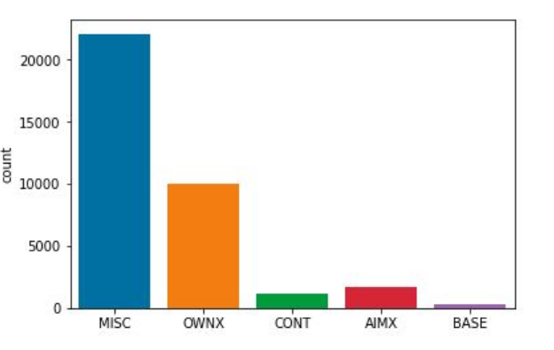

# MACHINE LEARNING PROJECT

## ABSTRACT

Number of research papers are increasing day by day. Main components of research paper are aim,base and contrast. If we can label sentences then a person looking for the paper can easily identify of the part he is interested. So in this project we use machine learning methods to tag the sentences.

## INTRODUCTION

This corpus contains sentences from the abstract and introduction of 30
scientific articles that have been annotated (i.e. labeled or tagged)
according to a modified version of the Argumentative Zones annotation
scheme [1]. These 30 scientific articles come from three different domains:

1. PLoS Computational Biology (PLOS)
2. The machine learning repository on arXiv (ARXIV)
3. The psychology journal Judgment and Decision Making (JDM)

There are 10 articles from each domain. In addition to the labeled data, this
corpus also contains a corresponding set of unlabeled articles. These
unlabeled articles also come from PLOS, ARXIV, and JDM. There are 300
unlabeled articles from each domain (again, only the sentences from the
abstract and introduction). These unlabeled articles can be used for
unsupervised or semi-supervised approaches to sentence classification
which rely on a small set of labeled data and a larger set of unlabeled data.

The annotation scheme used in this corpus is derived from AZ and includes
five labels:

1. AIM
2. OWN
3. CONTRAST
4. BASIS
5. MISCELLANEOUS

The labels AIM, OWN, CONTRAST, and BASIS correspond to the labels in
the original AZ scheme. The label MISCELLANEOUS is a combination of
BACKGROUND and OTHER since we found, in practice, that it was difficult
to distinguish between the two labels.

## PROCEDURE

Data was provided in raw format. So we can’t directly feed the sentences to
the models. So we have to do some pre-processing.

Preprocessing : Lines were read from each of the text file and stored in
dataframe with their corresponding label.(as shown below)


For each of sentence I removed all chars other than alphabets and made
every char to lowercase. I removed all the stop words like of (a,and,the).

After this I calculated the frequency of the words and kept top most 1000.
Now after this for each sentence I calculated the number of times this
words (top most) in that sentence. This method is called bag of words.

Target Distribution: The distribution of the target values are shown below


As you can the target values are imbalanced, it’s better to validate the
performance using F1-score rather than accuracy.

Model Training : I used naive bayes classifier and logistic regression with
L1 penalty(as the training matrix is sparse).

For me the logistic regression gave good performance in terms of F1-score.

## RESULTS

Score implies accuracy

For naive bayes classifier the results are shown below


For logistic regression the results are shown below


The parameters for logistic regression were

```bash
penalty='l1',solver='liblinear',C=6,class_weight='balanced'
```

I chose L1 regularization because the matrix is sparse, so the features
which are not useful L1 will take to zero coefficient.

## TEST DATA PREDICTIONS

Logistic regression predictions


Naive bayes classifier



## CONCLUSION

After seeing the performance in the validation data I chose the logistic for
test predictions as it performs really good.After seeing the performance in the validation data I chose the logistic for test predictions as it performs really good.
